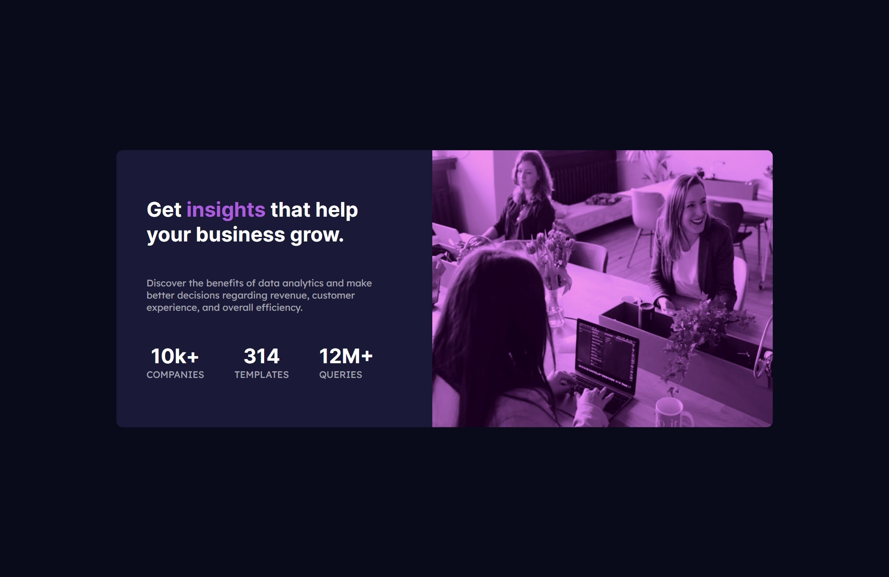

# preview card component solution

This is a solution to the [Stats preview card component challenge on Frontend Mentor](https://www.frontendmentor.io/challenges/stats-preview-card-component-8JqbgoU62). Frontend Mentor challenges help you improve your coding skills by building realistic projects.

## Table of contents

- [Overview](#overview)
  - [The challenge](#the-challenge)
  - [Screenshot](#screenshot)
  - [Links](#links)
- [My process](#my-process)
  - [Built with](#built-with)
  - [What I learned](#what-i-learned)
  - [Continued development](#continued-development)
  - [Useful resources](#useful-resources)
- [Author](#author)


**Note: Delete this note and update the table of contents based on what sections you keep.**

## Overview

### The challenge

Users should be able to:

- View the optimal layout depending on their device's screen size

### Screenshot




### Links
- Solution URL: [Add solution URL here](https://your-solution-url.com)
- Live Site URL: [Live Solution](https://github.com/cvalencia1991/Preview-Card-Component)

## My process

### Built with

- Semantic HTML5 markup
- CSS custom properties
- Flexbox
- CSS Grid
- Mobile-first workflow


**Note: These are just examples. Delete this note and replace the list above with your own choices**

### What I learned

Implement Filter

Use this section to recap over some of your major learnings while working through this project. Writing these out and providing code samples of areas you want to highlight is a great way to reinforce your own knowledge.

To see how you can add code snippets, see below:


```css
.imageDesktop{
  filter: invert(20%) sepia(4%) saturate(3837%) hue-rotate(243deg) brightness(80%) contrast(145%);
  }
```


### Continued development

Use this section to outline areas that you want to continue focusing on in future projects. These could be concepts you're still not completely comfortable with or techniques you found useful that you want to refine and perfect.

**Note: Delete this note and the content within this section and replace with your own plans for continued development.**

### Useful resources

- [Using filters in images](https://isotropic.co/tool/hex-color-to-css-filter/) - This helped me for Deploy the filter in any image that you want


## Author

👤 **Cesar Alberto Valencia Aguilar**

- GitHub: [https://github.com/cvalencia1991](https://github.com/cvalencia1991)
- Twitter: [https://twitter.com/cvalenciaguilar](@cvalenciaguilar)
- LinkedIn: [https://www.linkedin.com/in/cvalenciaguilar/](www.linkedin.com/in/cvalenciaguilar)


